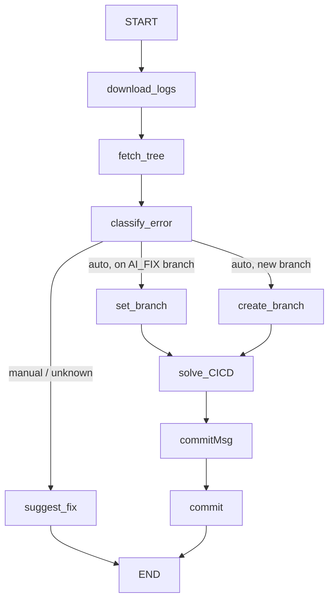

# 🔧 Self-Healing CI/CD Pipeline

An autonomous agent system that **detects, diagnoses, and repairs failed GitHub Actions workflows** — automatically opening a fix branch, patching the offending files, and committing a working solution, with no human intervention for auto-fixable issues.

Built with [LangGraph](https://github.com/langchain-ai/langgraph) for orchestration, GitHub Apps for repository access, and LLMs (Cerebras `gpt-oss-120b` + Google `gemini-2.5-flash`) for reasoning and code repair.

---

## 🌐 Webhook Endpoint

After deploying the project, configure your GitHub repository webhook to send workflow events to the following endpoint:

```text
https://self-healing-ci-cd-pipeline-1.onrender.com/webhook
```

### GitHub Webhook Configuration

In your GitHub repository:

1. Go to **Settings → Webhooks → Add webhook**.
2. Set **Payload URL** to:

   ```text
   https://self-healing-ci-cd-pipeline-1.onrender.com/webhook
   ```

3. Set **Content type** to:

   ```text
   application/json
   ```

4. Under **Which events would you like to trigger this webhook?**, choose:
   - **Workflow runs** (`workflow_run`) and **Push** (`push`)
5. Save the webhook.

The service listens for failed GitHub Actions workflow runs and automatically starts the self-healing pipeline.

## ✨ Features

- **Automatic failure detection** — triggered by a failed GitHub Actions workflow run.
- **Log analysis** — downloads and parses the full workflow run logs.
- **AI-powered classification** — determines whether a failure is:
  - `auto` — fixable by editing repo files (code, config, dependencies, workflow YAML)
  - `manual` — requires human action (secrets, credentials, permissions, outages)
  - `unknown` — insufficient information to decide
- **Safe branch isolation** — all fixes are committed to a dedicated `AI_FIX-<hash>` branch, never directly to the source branch.
- **Loop protection** — if a workflow re-runs on an existing `AI_FIX` branch, the pipeline reuses it instead of spawning a new one.
- **Tool-using repair agent** — reads real file contents before editing, makes surgical changes (`replace` / `insert_before` / `insert_after` / `delete`), and never guesses dependency files.
- **Multi-error awareness** — scans full logs for multiple independent failures in a single run, not just the first error.
- **Auto-generated commit messages** — a dedicated LLM step writes a concise, conventional commit message describing the actual fix.
- **Traceable** — all major steps are wrapped with LangSmith `@traceable` for observability and debugging.

---

## 🏗️ Architecture

The system is modeled as a directed graph of nodes (LangGraph `StateGraph`), where each node performs one responsibility and hands off state to the next.



### Node responsibilities

| Node                           | Purpose                                                                                                                                            |
| ------------------------------ | -------------------------------------------------------------------------------------------------------------------------------------------------- |
| `download_logs`                | Downloads and unzips the failed workflow run's logs via the GitHub Actions API.                                                                    |
| `fetch_tree`                   | Resolves the **live** HEAD of the branch and lists every file path in the repo (avoids stale webhook SHAs).                                        |
| `classify_error`               | Uses an LLM with a structured output schema to classify the failure as `auto` / `manual` / `unknown`, with a confidence score and detailed reason. |
| `check_branch` (router)        | Decides the next path: skip to `suggest_fix` if not auto-fixable; otherwise reuse an existing `AI_FIX` branch or create a new one.                 |
| `create_branch` / `set_branch` | Creates a fresh `AI_FIX-<uuid>` branch from the current HEAD, or reuses the current branch if already on one.                                      |
| `solve_CICD`                   | The repair **agent** — investigates the failure using tools and proposes/applies file edits.                                                       |
| `commitMsg`                    | Generates a concise, imperative-mood commit message summarizing the fix.                                                                           |
| `commit`                       | Commits all staged file changes to the fix branch as a single Git commit.                                                                          |
| `suggest_fix`                  | For non-auto-fixable errors, produces a human-readable suggestion instead of editing code.                                                         |

### The repair agent (`solve_CICD`)

A tool-using LangChain agent (`gemini-2.5-flash`) equipped with:

- **`read_file`** / **`read_multiple_files`** — reads real file contents from the correct branch before editing.
- **`search_code`** — searches the default branch for symbols, imports, or configuration (note: not branch-aware).
- **`create_file`** — creates new files, but only if they don't already exist (never fabricates dependency files without inspecting real usage first).
- **`update_file`** — applies precise, minimal edits (`replace`, `insert_before`, `insert_after`, `delete`) using exact text targets copied from the file it just read.

The agent follows a strict system prompt that enforces:

1. Scanning logs for _all_ distinct errors, not just the first one.
2. Reading files before editing them — never guessing content.
3. Investigating whether a failing test or the source code is actually at fault.
4. Making the smallest possible change rather than rewriting files wholesale.
5. Refusing to guess when no safe fix can be determined, and explaining why manual intervention is needed instead.

---

## 🛠️ Tech Stack

| Layer                            | Technology                                                                                                 |
| -------------------------------- | ---------------------------------------------------------------------------------------------------------- |
| Orchestration                    | [LangGraph](https://github.com/langchain-ai/langgraph) (`StateGraph`)                                      |
| Repair agent                     | [LangChain](https://github.com/langchain-ai/langchain) `create_agent` + Google Gemini (`gemini-2.5-flash`) |
| Classification / commit messages | Cerebras-hosted `gpt-oss-120b` via `ChatOpenAI` (OpenAI-compatible endpoint)                               |
| Source control                   | [PyGithub](https://github.com/PyGithub/PyGithub) with a **GitHub App** installation token                  |
| Observability                    | [LangSmith](https://www.langchain.com/langsmith) tracing                                                   |

---

## 📁 Project Structure

```
.
├── graph.py          # LangGraph StateGraph definition — the pipeline itself
├── function.py       # Node implementations (logs, tree, classify, branch, commit, etc.)
├── agent.py          # solveCICD: the tool-using repair agent
├── agent_tools.py     # Tools available to the repair agent (read/search/create/update files)
├── state.py          # Shared graph state schema + structured-output Pydantic models
└── README.md
```

---

## ⚙️ Setup

### Prerequisites

- Python 3.10+
- A **GitHub App** installed on the target repository(ies), with permissions:
  - Contents: Read & write
  - Actions: Read
  - Metadata: Read
- API keys for Cerebras and Google Generative AI
- (Optional) A LangSmith account for tracing

### Installation

```bash
git clone <your-repo-url>
cd <your-repo>
pip install -r requirements.txt
```

### Environment Variables

Create a `.env` file in the project root:

```env
# GitHub App
GITHUB_APP_ID=123456
GITHUB_PRIVATE_KEY_PATH=/path/to/private-key.pem

# LLM providers
CEREBRAS_API_KEY=your_cerebras_key
GOOGLE_API_KEY=your_google_generative_ai_key

# Observability (optional)
LANGCHAIN_TRACING_V2=true
LANGCHAIN_API_KEY=your_langsmith_key
LANGCHAIN_PROJECT=self-healing-cicd
```

---

## 🚀 Usage

The graph expects an initial state describing the failed workflow run — typically populated from a GitHub webhook (e.g. `workflow_run` event with conclusion `failure`):

```python
from graph import workflow

initial_state = {
    "owner": "your-org",
    "repo": "your-repo",
    "installation_id": 12345678,
    "workflow_run_id": 987654321,
    "workflow_name": "CI",
    "workflow_file": "ci.yml",
    "branch": "main",
    "commit_sha": "",
    "file_contents": {},
    "modified_files": {},
}

result = workflow.invoke(initial_state)
print(result)
```

**Typical outcomes:**

- ✅ **Auto-fixable** — a new (or reused) `AI_FIX-xxxxxxxx` branch is pushed with a fix commit. You can then open a PR from that branch for review.
- 📋 **Manual** — no code changes are made; `suggested_changes` in the result contains a human-readable explanation and recommended next steps.
- ❓ **Unknown / agent failure** — the pipeline reports what it found without applying changes, so a human can investigate.

### Wiring it to real webhooks

In production, this graph is typically invoked from a webhook receiver (e.g. a small Flask/FastAPI service) that listens for GitHub's `workflow_run` event with `action: completed` and `conclusion: failure`, extracts the relevant fields, and calls `workflow.invoke(...)`.

---

## 🔒 Safety Notes

- All automated changes land on an isolated `AI_FIX-*` branch — **never** pushed directly to `main` or the source branch.
- The pipeline re-resolves the branch's live HEAD at each relevant step instead of trusting a possibly-stale webhook SHA, avoiding conflicts from concurrent commits or re-runs.
- The repair agent is instructed to make minimal, targeted edits and to decline (rather than guess) when it cannot find a safe fix.
- Review is still recommended: treat the `AI_FIX` branch as a draft PR, not an auto-merge.

---

## 🗺️ Roadmap Ideas

- [ ] Auto-open a pull request from the `AI_FIX` branch with a summary of changes
- [ ] Email/Slack notifications on success and manual-intervention cases (`sendEmail` / `successMail` stubs are in place)
- [ ] Re-run the workflow automatically after committing a fix, and roll back if it still fails
- [ ] Support for GitLab CI / CircleCI in addition to GitHub Actions

---

## 📄 License

Add your preferred license here (e.g. MIT).
